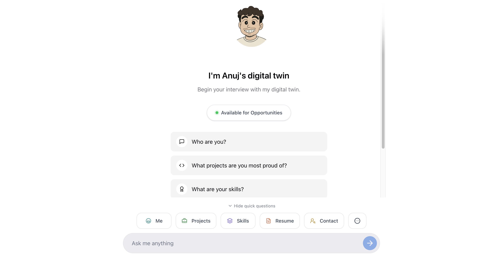

# 🤖 AI-Powered Portfolio with Single JSON Configuration

A **revolutionary portfolio system** that allows complete customization through a single JSON file. Perfect for developers who want a professional AI-powered portfolio without touching any code.



[](https://portfolio.anujjainbatu.tech/)
[](docs/LICENSE)
[](https://www.typescriptlang.org/)
[](docs/CONTRIBUTING.md)
[](https://github.com/anujjainbatu/portfolio/issues)
[](https://github.com/anujjainbatu/portfolio/stargazers)

## 🎯 Why This Portfolio System?

| Traditional Portfolio Problems ❌ | Our Solution ✅ |
|---|---|
| Edit 10+ files for simple changes | **Edit 1 JSON file** - Everything updates automatically |
| Risk breaking functionality | **Zero code knowledge** required |
| Need to understand complex codebase | **AI-powered chat** that knows all about you |
| Hours of work for basic updates | **Modern, responsive design** out of the box |

## 🚀 Quick Start (5 Minutes Setup)

<details>
<summary><strong>📋 Step-by-Step Setup</strong></summary>

### 1. Fork & Clone
```bash
git clone https://github.com/your-username/portfolio.git
cd portfolio
```

### 2. Install Dependencies
```bash
npm install
# or
pnpm install
# or 
yarn install
```

### 3. Get Google Gemini API Key
1. Visit [Google AI Studio](https://aistudio.google.com/)
2. Sign in with your Google account
3. Click "Get API Key" → "Create API Key"
4. Copy the generated key (starts with `AIza...`)

### 4. Configure Environment
Create `.env.local` file (copy from `.env.example`):
```env
# Required for AI chat functionality
GOOGLE_GENERATIVE_AI_API_KEY=your_google_ai_api_key_here
```

### 5. Update Your Info
Edit `portfolio-config.json` with your information (see AI Generation section below)

### 6. Add Your Images
Replace these files in `/public/` folder:
- `profile.jpeg` - Your profile picture
- `avatar.png` - Chat avatar (optional)
- `project-*.jpg` - Project screenshots

### 7. Run Development Server
```bash
npm run dev
```
Open [http://localhost:3000](http://localhost:3000) to see your portfolio!

### 8. Deploy to Production
```bash
npm run build
```
Deploy to Vercel, Netlify, or any hosting service

</details>

## 🤖 AI-Powered JSON Generation

<details>
<summary><strong>🎯 Method 1: AI Generation (Recommended)</strong></summary>

Upload these files to **Claude** or **ChatGPT**:
1. Your current resume (PDF/DOC)
2. The sample `portfolio-config.json`

**Copy this prompt:**
```
I want to create a portfolio using this JSON configuration system. 

Here's the sample JSON structure: [paste portfolio-config.json]
Here's my resume: [upload your resume]

Please generate a complete portfolio-config.json file for me with:
1. My personal information from the resume
2. All my skills and technologies 
3. My work experience and projects
4. Appropriate preset questions for an AI chat
5. Professional personality traits

Also tell me what image files I need to prepare and their recommended sizes.
```

</details>

<details>
<summary><strong>✏️ Method 2: Manual Editing</strong></summary>

Edit `portfolio-config.json` sections:

```json
{
  "personal": {
    "name": "Your Full Name",
    "title": "Your Professional Title",
    "email": "your.email@example.com",
    "bio": "Brief description about yourself..."
  },
  "skills": {
    "programming": ["JavaScript", "Python", "Java"],
    "web_development": ["React", "Node.js", "MongoDB"]
  },
  "projects": [
    {
      "title": "Your Amazing Project",
      "description": "What this project does...",
      "techStack": ["React", "TypeScript", "Firebase"],
      "githubUrl": "https://github.com/you/project",
      "liveUrl": "https://your-project.com",
      "images": [{"src": "/project-1.jpg", "alt": "Project screenshot"}]
    }
  ]
}
```

</details>

## 📁 File Structure & Architecture

<details>
<summary><strong>🗂️ Complete File Structure</strong></summary>

```
portfolio/
├── 📄 portfolio-config.json          # 🎯 MAIN CONFIG - Edit this file only!
├── 📁 public/                        # 🖼️ Your images and assets
│   ├── profile.jpeg                  # Your main profile picture
│   ├── avatar.png                    # Chat bot avatar (optional)
│   ├── favicon.ico                   # Website icon
│   └── project-*.jpg                 # Project screenshots
├── 📁 src/
│   ├── 📁 app/
│   │   ├── layout.tsx                # Main app layout
│   │   ├── page.tsx                  # Home page component
│   │   ├── globals.css               # Global styles
│   │   └── 📁 api/chat/              # AI chat system
│   │       ├── route.ts              # Chat API endpoint
│   │       └── 📁 tools/             # AI tools for different sections
│   │           ├── getPresentation.ts # "Who are you?" tool
│   │           ├── getProjects.ts    # Projects display tool
│   │           ├── getSkills.ts      # Skills display tool
│   │           ├── getContact.ts     # Contact info tool
│   │           ├── getResume.ts      # Resume display tool
│   │           └── getIntership.ts   # Availability/opportunities tool
│   ├── 📁 components/                # React UI components
│   │   ├── presentation.tsx          # About/bio section
│   │   ├── skills.tsx                # Skills grid display
│   │   ├── contact.tsx               # Contact information
│   │   ├── resume.tsx                # Resume viewer
│   │   ├── AvailabilityCard.tsx      # Job availability card
│   │   ├── theme-provider.tsx        # Dark/light mode
│   │   ├── 📁 projects/              # Project-related components
│   │   │   ├── AllProjects.tsx       # Projects grid
│   │   │   ├── ConfigData.tsx        # Project data from config
│   │   │   └── apple-cards-carousel.tsx # Interactive project carousel
│   │   ├── 📁 chat/                  # AI chat system
│   │   │   ├── chat.tsx              # Main chat interface
│   │   │   ├── chat-landing.tsx      # Welcome screen with buttons
│   │   │   ├── HelperBoost.tsx       # Quick questions drawer
│   │   │   ├── preset-reply.tsx      # Preset responses
│   │   │   ├── simple-chat-view.tsx  # AI responses
│   │   │   └── tool-renderer.tsx     # Renders different components
│   │   └── 📁 ui/                    # Reusable UI components
│   ├── 📁 lib/
│   │   ├── config-loader.ts          # 🔧 Loads JSON configuration
│   │   ├── config-parser.ts          # 🔧 Transforms JSON to components
│   │   └── utils.ts                  # Utility functions
│   ├── 📁 types/
│   │   └── portfolio.ts              # 🔧 TypeScript type definitions
│   └── 📁 hooks/                     # React custom hooks
├── 📄 package.json                   # Dependencies and scripts
├── 📄 next.config.ts                 # Next.js configuration
├── 📄 tailwind.config.ts             # Styling configuration
├── 📄 tsconfig.json                  # TypeScript configuration
└── 📄 components.json                # UI components configuration
```

</details>

## 🎨 Images & Assets Guide

<details>
<summary><strong>🖼️ Required Images & Specifications</strong></summary>

### Required Images:
1. **Profile Picture** (`public/profile.jpeg`)
   - **Size**: 400x400px minimum
   - **Format**: JPEG/PNG
   - **Use**: Main profile photo, chat avatar

2. **Project Screenshots** (`public/project-1.jpg`, `public/project-2.jpg`, etc.)
   - **Size**: 1200x800px recommended (16:9 ratio)
   - **Format**: JPEG/PNG/WebP/GIF
   - **Use**: Project portfolio carousel
   - **Tip**: Horizontal screenshots work best with the new layout

3. **Favicon** (`public/favicon.ico`) - Optional
   - **Size**: 32x32px
   - **Format**: ICO/PNG
   - **Use**: Browser tab icon

### Image Optimization Tips:
- Use tools like [TinyPNG](https://tinypng.com/) to compress images
- Keep file sizes under 1MB for better performance
- Use descriptive filenames (e.g., `ecommerce-project.jpg`)
- GIFs are supported for project demos

### GitHub Images:
You can directly use GitHub raw URLs in your config:
```json
{
  "src": "https://raw.githubusercontent.com/username/repo/main/assets/demo.gif",
  "alt": "Project Demo"
}
```

</details>

## 🤖 AI Chat System Configuration

<details>
<summary><strong>🧠 Chat System Features</strong></summary>

The AI chatbot is configured through your JSON file:

```json
{
  "chatbot": {
    "name": "Your Digital Twin",
    "personality": "Professional yet friendly",
    "tone": "Conversational and helpful",
    "responseStyle": "Concise with personality"
  },
  "presetQuestions": {
    "me": ["Who are you?", "Tell me about yourself"],
    "professional": ["What are your skills?", "Can I see your resume?"],
    "projects": ["What projects are you most proud of?"],
    "contact": ["How can I reach you?"]
  }
}
```

### Chat Features:
- **Preset Responses**: Fast, curated answers for common questions
- **AI Responses**: Dynamic responses using Google Gemini API
- **Tool Integration**: Automatically shows relevant components
- **Quota Management**: Graceful handling of API limits
- **Mobile Optimized**: Works seamlessly on all devices

</details>

## 🔧 Environment & Configuration

<details>
<summary><strong>⚙️ Environment Setup</strong></summary>

### Environment Variables
Create `.env.local` file:
```env
# Required for AI chat functionality
GOOGLE_GENERATIVE_AI_API_KEY=your_google_ai_api_key

# Optional - for custom domain
NEXT_PUBLIC_SITE_URL=https://your-domain.com
```

### Getting Google Gemini API Key:
1. **Visit**: [Google AI Studio](https://aistudio.google.com/)
2. **Sign in**: Use your Google account
3. **Create Key**: Click "Get API Key" → "Create API Key"
4. **Copy**: Save the key (starts with `AIza...`)
5. **Add to .env.local**: Paste in your environment file

### Validation Commands:
```bash
# Check JSON syntax
node -e "console.log('Valid JSON:', !!JSON.parse(require('fs').readFileSync('portfolio-config.json')))"

# Run type checking
npm run type-check

# Test build
npm run build
```

</details>

## 🚀 Deployment Guide

<details>
<summary><strong>🌐 Deploy to Vercel (Recommended)</strong></summary>

### Quick Deploy:
[](https://vercel.com/new/clone?repository-url=https%3A%2F%2Fgithub.com%2Fanujjainbatu%2Fportfolio)

### Manual Deploy:
1. **Push to GitHub**: Ensure your code is in a GitHub repository
2. **Connect Vercel**: Import your repository in Vercel dashboard
3. **Add Environment Variables**: 
   - Go to Settings → Environment Variables
   - Add: `GOOGLE_GENERATIVE_AI_API_KEY=your_key_here`
4. **Deploy**: Click deploy and wait for build completion

### Other Hosting Options:
- **Netlify**: Similar process, add env vars in site settings
- **GitHub Pages**: Static export with `npm run build && npm run export`
- **Railway**: Connect GitHub repo and add environment variables

</details>

## 🛠️ Customization & Advanced Features

<details>
<summary><strong>🎨 Advanced Customization</strong></summary>

### Custom Themes:
Edit `tailwind.config.ts` for custom colors and styling.

### Adding New Sections:
1. Update `portfolio-config.json` with new data
2. Create component in `src/components/`
3. Add tool in `src/app/api/chat/tools/`
4. Update type definitions in `src/types/portfolio.ts`

### Image Hosting:
- **Local**: Store in `public/` folder
- **GitHub**: Use raw URLs from your repositories
- **CDN**: Any public CDN (Cloudinary, AWS S3, etc.)

### Analytics Integration:
Add Google Analytics, Vercel Analytics, or other tracking in `layout.tsx`.

</details>

## 🆘 Troubleshooting & Support

<details>
<summary><strong>🔧 Common Issues & Solutions</strong></summary>

### Common Problems:

**Q: AI chat not working?**
- A: Check your `GOOGLE_GENERATIVE_AI_API_KEY` in `.env.local`
- Ensure the key is valid and has quota remaining

**Q: Images not showing?**
- A: Ensure images are in `/public/` folder and paths in JSON match filenames
- Check if external URLs are accessible

**Q: Build failing?**
- A: Run `npm run type-check` to validate your JSON configuration
- Check for JSON syntax errors

**Q: API quota exhausted?**
- A: The system shows a friendly message and fallback to preset responses
- Quota resets daily on free Gemini API

**Q: Want to add new features?**
- A: Most customization can be done through JSON
- For advanced features, modify the components

### Get Help:
- 🐛 [Open an Issue](https://github.com/anujjainbatu/portfolio/issues)
- 📧 Email: anujjainbatu@gmail.com
- 💬 [Discussions](https://github.com/anujjainbatu/portfolio/discussions)

</details>

## 📚 Documentation

<details>
<summary><strong>📖 Complete Documentation</strong></summary>

All comprehensive documentation is available in the [`docs/`](docs/) folder:

### 📋 Available Guides
- **[Contributing Guide](docs/CONTRIBUTING.md)** - How to contribute to the project
- **[License](docs/LICENSE)** - MIT License details and usage rights
- **[Documentation Index](docs/README.md)** - Complete documentation overview

### 🔍 Quick References
- **Setup Guide** - See [Quick Start](#-quick-start-5-minutes-setup) section above
- **Configuration** - See [AI-Powered JSON Generation](#-ai-powered-json-generation) section
- **Deployment** - See [Deployment Guide](#-deployment-guide) section
- **Troubleshooting** - See [Troubleshooting & Support](#-troubleshooting--support) section

</details>

## 🤝 Contributing

We welcome contributions from the community! Whether you're fixing bugs, adding new features, improving documentation, or sharing feedback, your contributions make this project better for everyone.

### Quick Start for Contributors

1. **Read our [Contributing Guide](docs/CONTRIBUTING.md)** - Comprehensive guidelines for contributors
2. **Check [open issues](https://github.com/anujjainbatu/portfolio/issues)** - Find something to work on
3. **Join [Discussions](https://github.com/anujjainbatu/portfolio/discussions)** - Share ideas and get help

### Ways to Contribute

- 🐛 **Report bugs** or suggest improvements
- 💡 **Propose new features** like chat tools or UI components
- 📝 **Improve documentation** and examples
- 🎨 **Design enhancements** and theme contributions
- 🧪 **Testing** on different configurations
- 🌍 **Translations** and internationalization

<details>
<summary><strong>🔄 Development Workflow</strong></summary>

1. Fork the repository
2. Create your feature branch: `git checkout -b feature/amazing-feature`
3. Commit your changes: `git commit -m 'Add amazing feature'`
4. Push to the branch: `git push origin feature/amazing-feature`
5. Open a Pull Request

### Development Commands:
```bash
npm run dev          # Start development server
npm run build        # Build for production
npm run type-check   # Type checking
npm run lint         # ESLint checking
```

### Environment Setup:
```bash
# Copy environment template
cp .env.example .env.local

# Add your Google Gemini API key
echo "GOOGLE_GENERATIVE_AI_API_KEY=your_key_here" >> .env.local
```

</details>

## 📄 License

This project is licensed under the MIT License - see the [LICENSE](docs/LICENSE) file for details.

### What This Means:
- ✅ **Commercial use** - Use for business projects
- ✅ **Modification** - Customize as needed
- ✅ **Distribution** - Share with others
- ✅ **Private use** - Use in private projects
- ⚠️ **Liability** - No warranty provided
- ⚠️ **Attribution** - Include original license

## 🌟 Showcase

**Want to be featured?** Share your portfolio built with this system!

<details>
<summary><strong>🎉 Community Portfolios</strong></summary>

Submit your portfolio to be featured here:
- Add your portfolio URL
- Include a brief description
- Show off your customizations

**To submit**: Open an issue with the "showcase" label or email anujjainbatu@gmail.com

</details>

## 🏗️ Repository Structure

```
portfolio/
├── � docs/                      # 📚 Documentation
│   ├── CONTRIBUTING.md           # Contributing guidelines
│   └── LICENSE                   # MIT License
├── 📄 README.md                  # This file
├── 📄 .env.example               # Environment variables template
├── 📄 portfolio-config.json      # 🎯 Main configuration file
├── 📁 public/                    # Static assets
├── 📁 src/                       # Source code
└── 📁 assets/                    # Documentation assets
```

## 🚀 Deployment Status

- **Demo**: [Live Site](https://portfolio.anujjainbatu.tech/)
- **Status**: ✅ Production Ready
- **Framework**: Next.js 15
- **Hosting**: Vercel (recommended)

---

<div align="center">

**Made with ❤️ for developers by developers**

Transform your career with a professional AI-powered portfolio that takes minutes to set up and zero code to maintain.

### 🌟 Show Your Support

If this project helped you, please consider:
- ⭐ **Star this repo** on GitHub
- 🐦 **Share on Twitter** with hashtag #AIPortfolio
- 💬 **Join our discussions** for updates and support
- 🤝 **Contribute** to make it even better

[⭐ Star on GitHub](https://github.com/anujjainbatu/portfolio) | [🐛 Report Bug](https://github.com/anujjainbatu/portfolio/issues) | [💡 Request Feature](https://github.com/anujjainbatu/portfolio/issues) | [� Documentation](docs/) | [�💬 Discussions](https://github.com/anujjainbatu/portfolio/discussions)

</div>
